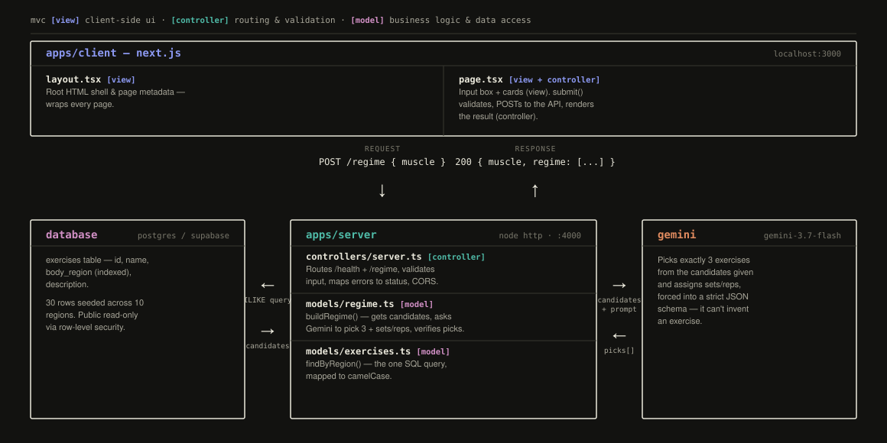

# Rebound

An AI coach that keeps athletes training instead of sidelined — no doctor's referral, no insurance, no waiting.

## What this does

This is a small toy version proving one idea end to end: you tell it what body part hurts, and it returns a few exercises for it, with an AI-assigned number of sets and reps for each. One screen, one API endpoint, one database table.

Step by step:

1. You open a webpage with one input box.
2. You type a body part that hurts — like "knee."
3. It sends that to a backend server.
4. The server looks in a database for exercises tagged for that body part (30 exercises pre-loaded, across 9 body regions: knee, shoulder, lower back, hamstring, ankle, hip, neck, wrist, elbow, calf).
5. It hands that list of matching exercises to Google's Gemini AI and asks it: pick exactly 3 of these, and decide how many sets and reps of each.
6. Gemini sends back its picks.
7. The server sends those 3 exercises back to the webpage, which displays them as cards — name, description, and sets × reps.

**What it deliberately does *not* do:** no login/accounts, no saving your history, no daily check-ins, no adjusting a plan over time, and no safety checks on what the AI recommends — if Gemini says "do 30 reps," the app just shows 30 reps, no validation. That's intentional for a toy version — a real safety-checking layer is planned for later (see [`/roadmap`](./roadmap)), not built yet.



## Team responsibilities

*(fill in names/roles)*

**Backend / API** —

**Frontend / UI** —

**Shared decisions** —

## Tech stack

**API** (`apps/api`)
- Node.js `http` server — no framework, just plain Node
- [`pg`](https://node-postgres.com/) — direct Postgres driver
- [`@google/genai`](https://github.com/googleapis/js-genai) — Gemini calls
- TypeScript, run via `tsx`

**Web** (`apps/web`)
- [Next.js](https://nextjs.org/) (App Router)
- React

**Database**
- Postgres, hosted for free on [Supabase](https://supabase.com)
- One migration tool, [`node-pg-migrate`](https://github.com/salsita/node-pg-migrate), for the one table this app uses

**Tooling**
- [pnpm](https://pnpm.io/) workspaces — monorepo with `apps/api` and `apps/web`
- [Vitest](https://vitest.dev/) — the 10 tests in `server.test.ts`
- ESLint

## The database

One table, `exercises`:

| Column | What it holds |
|---|---|
| `id` | Unique id for the row |
| `name` | Exercise name, e.g. "Wall Sit" |
| `body_region` | What it's for, e.g. "knee" — this is what gets matched against your search |
| `description` | Plain-language instructions |
| `created_at` | When the row was added |

It's seeded with 30 hand-written exercises across 9 body regions. When you search "knee," the API pulls every row where `body_region` matches, hands that list to Gemini, and asks it to pick 3 and assign sets/reps.

## Roadmap

The full product idea — auth, daily check-ins, weekly AI plan adjustments, a safety-validation layer, and the database structure to support all of it — is planned out but **not built into this app yet**. That planning, plus the more advanced database work we prototyped and then intentionally set aside to stay in scope for this week, lives on the [`future-work`](../../tree/future-work) branch and in [`/roadmap`](./roadmap) — not wired into the app above.

## How to run it locally

1. Create a free [Supabase](https://supabase.com) project (this is just Postgres, hosted for free).
2. Copy `.env.example` to `.env` and fill in:
   - `DATABASE_URL` — Supabase Dashboard → Connect → **Transaction pooler** (port 6543)
   - `GEMINI_API_KEY` — free key from [aistudio.google.com/apikey](https://aistudio.google.com/apikey)
3. Install dependencies:
   ```
   pnpm install
   ```
4. Create and seed the database:
   ```
   pnpm --filter @rebound/api run db:setup
   ```
5. Start the API:
   ```
   pnpm --filter @rebound/api run dev
   ```
6. In a second terminal, start the web app:
   ```
   pnpm --filter web run dev
   ```
7. Open the URL Next.js prints (`http://localhost:3000`), type a body part like "knee", click "Get exercises."
