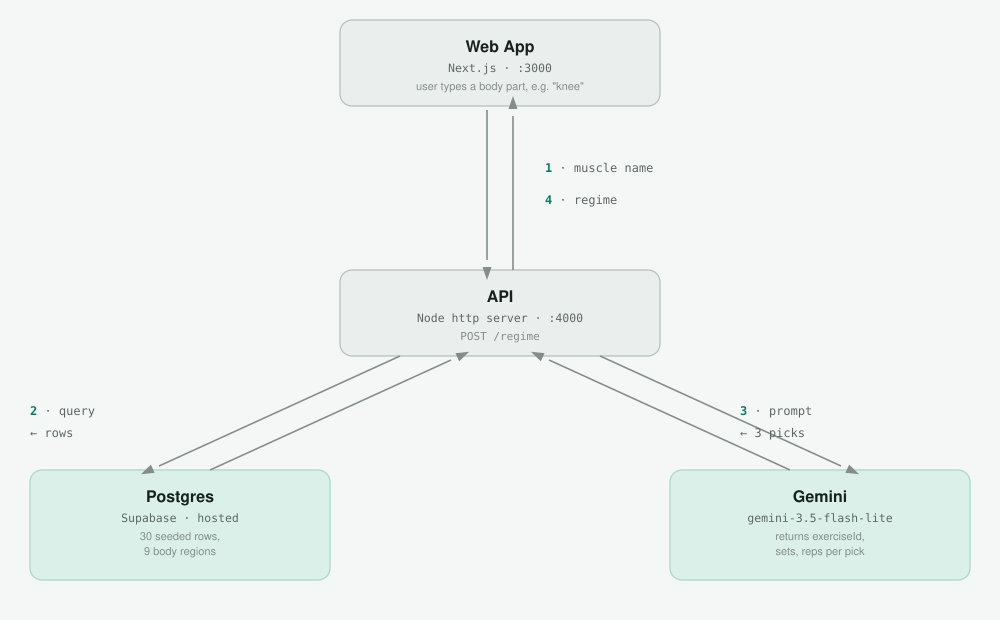

# Rebound

An AI coach that keeps athletes training instead of sidelined — no doctor's referral, no insurance, no waiting. Full product idea, safety rules, and long-term architecture are in [`documents/`](./documents).

## What this does right now

A user describes what hurts, and the app returns exercises with AI-assigned sets/reps.

- One screen — type a body part (e.g. "knee")
- One API endpoint — looks up matching exercises, asks Gemini to pick 3 and dose them
- Returns the 3 picks, rendered as cards

There's no auth, onboarding, daily check-ins, weekly plan adjustments, or safety-validation layer yet — Gemini's sets/reps are currently unvalidated. See [`documents/GAME_PLAN.md`](./documents/GAME_PLAN.md) for what's next.



## Tech stack

**API** (`apps/api`)
- Node.js `http` server (no framework)
- [`pg`](https://node-postgres.com/) — direct Postgres driver
- [`@google/genai`](https://github.com/googleapis/js-genai) — Gemini calls
- TypeScript, run via `tsx`

**Web** (`apps/web`)
- [Next.js](https://nextjs.org/) (App Router)
- React

**Database**
- Postgres, hosted on [Supabase](https://supabase.com)

**Tooling**
- pnpm workspaces (monorepo: `apps/api`, `apps/web`)
- GitHub Actions CI on every push/PR to `main`: lint → typecheck → test → build, plus two dedicated jobs against the live database — RLS-decision coverage and a cross-user isolation test

## Progress: Phase B & Phase C

Development is tracked against [`documents/IMPLEMENTATION_TODO.md`](./documents/IMPLEMENTATION_TODO.md), a phased checklist from current state to shipped.

### In plain terms

We rebuilt the database the right way and proved it's actually safe.

Before this: one temporary database table, no real security, no repeatable setup process. Now: the full database structure the product needs is built (13+ tables covering users, workout plans, daily check-ins, etc.), every table has a security rule locking each user to only their own data, and — most importantly — we didn't just assume that security rule works, we wrote a real test that tries to break it (two fake users try to read each other's data) and confirmed it can't be broken. Automated checks now catch it immediately if any of this is ever accidentally turned off.

One piece is still on hold: the real exercise library. That data comes from a paid third-party provider whose access/pricing isn't confirmed yet, so it's a licensing question, not something we can code our way past.

### Technical details

**Phase B — Foundation.** Real versioned migrations (`node-pg-migrate`) replaced the old drop-and-reseed script; Row-Level Security turned on with an explicit, CI-enforced decision per table; ESLint and a shared test config added; the two original endpoint tests restored; a startup check that fails loudly on missing config instead of crashing deep in a request.

**Phase C — Data layer.** All 13 tables from `documents/DATA_MODEL.md` now exist as real migrations — `User`, `Regime`, `WorkoutSession`, `SessionLog`, `AdjustmentEvent`, `Preset`, `LlmCall`, and more — each with its own RLS policy, verified against the live database (`check:rls` passes at 15/15 tables). A two-tier database role split was added: a privileged role for migrations/admin work, and a restricted role that can only see rows matching its own user id. That isolation is proven with a real test — two fake users, one connection each, confirmed neither can read or write the other's data — not just assumed. CI now runs migrations against the live database and re-verifies both the RLS coverage and the isolation test on every push.

One open decision got resolved along the way: whether exercise media (images/videos) should link directly to the data vendor's servers or be re-hosted by this project. Self-hosting won ([`adr/0020`](./adr/0020-self-hosted-exercise-media.md)) — linking directly was the exact mistake that silently broke every exercise image in the previous version of this project when the vendor's server wasn't allowlisted.

**What's still blocked:** pulling in the real exercise catalogue (currently 30 hand-written placeholder rows) needs a licensed data provider (AscendAPI) whose access and pricing haven't been confirmed yet. The database schema is fully ready to receive that data the moment it exists.

## Setup

1. Create a free [Supabase](https://supabase.com) project.
2. Copy `.env.example` to `.env` and fill in:
   - `DATABASE_URL` — Supabase Dashboard → Connect → **Transaction pooler** (port 6543)
   - `GEMINI_API_KEY` — from [aistudio.google.com/apikey](https://aistudio.google.com/apikey)
3. Install dependencies:
   ```
   pnpm install
   ```
4. Create and seed the database:
   ```
   pnpm --filter @rebound/api run db:setup
   ```
5. Start the API:
   ```
   pnpm --filter @rebound/api run dev
   ```
6. In a second terminal, start the web app:
   ```
   pnpm --filter web run dev
   ```
7. Open the URL Next.js prints, type a body part, click "Get exercises."
