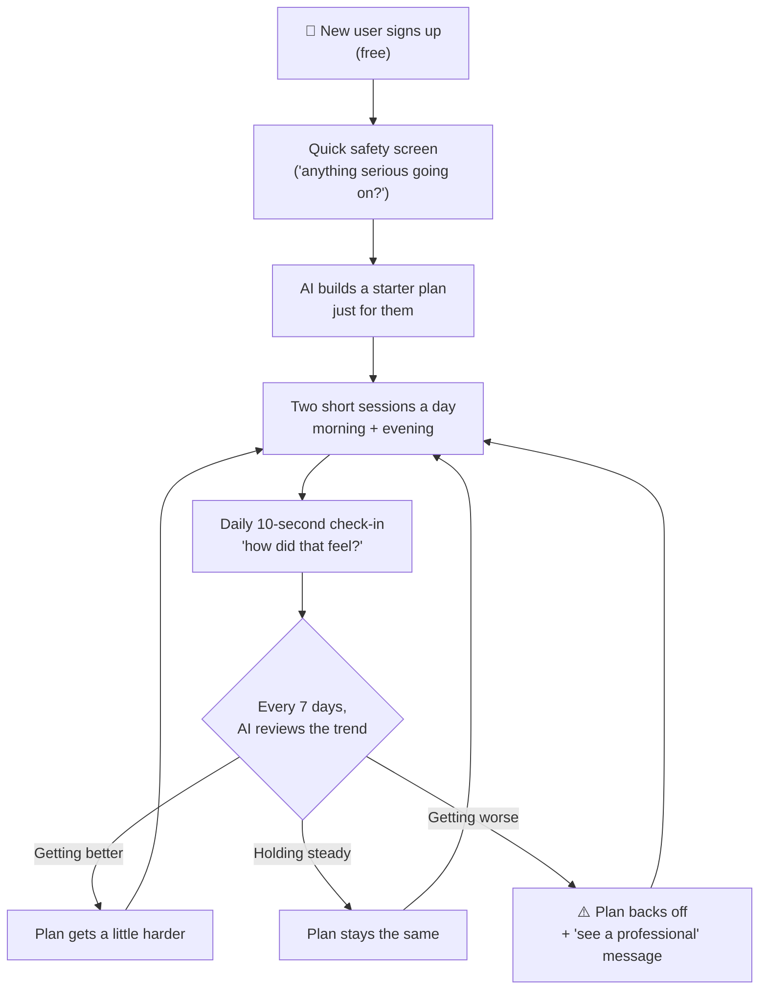

# Rebound

**An AI coach that keeps athletes training instead of sidelined — no doctor's referral, no insurance, no waiting.**

---

## The problem, in plain terms

Athletes get nagging injuries and tight, overworked bodies all the time — a cranky knee, a stiff shoulder, a hamstring that's "not quite right." Two bad options exist today:

1. **See a physical therapist.** Slow, expensive, needs a referral and insurance approval. Most people never even start.
2. **Use a generic fitness app.** Fast and cheap, but it has no idea you're hurt — it just tells you to push harder.

So people either do nothing and stay hurt, or push through pain and make it worse. The missing piece is something that watches how you're actually doing, day to day, and adjusts your training around it — automatically.

## The idea, in one sentence

**Rebound.ai is an app that asks you two quick questions a day, watches how your pain and mobility trend over time, and automatically rewrites your training plan every week so you keep improving instead of getting hurt again.**

Think of it like a Duolingo streak, but instead of a language, it's your recovery — and instead of a fixed lesson plan, an AI is redesigning the plan around you every week.

## How it works

Two safety nets run underneath all of this, all the time:
- **A same-day red flag check** — anything that sounds like a real medical issue routes straight to "go see a doctor," no AI plan generated.
- **A real-time pain-spike watchdog** — if a session makes things noticeably worse, the plan rolls back immediately, not at the next weekly review.

That combination — daily habit loop + weekly AI adjustment + always-on safety monitoring — is the whole product.

## Why this wins vs. what exists today

| | Physical therapy apps (Sword, Hinge Health) | Generic fitness apps | **Rebound.ai** |
|---|---|---|---|
| Get started | Referral, insurance, scheduling | Instant | **Instant** |
| Cost | High (clinician-in-the-loop) | Low | **Low** (no clinician overhead) |
| Knows you're hurt? | Yes | No | **Yes** |
| Adjusts automatically | Slowly, human-paced | Never | **Every week, by AI** |
| Daily habit design | Not the focus | Sometimes | **Core to the product** |

The bet: most people don't need a licensed clinician managing every decision — they need a plan that actually pays attention to them and adjusts, at a price and speed a clinician-staffed model can't match.

## Business model

- **Subscription**, not a one-time purchase — the plan keeps adapting every week, so the value (and the AI cost behind it) is ongoing.
- **Free trial built into the product itself**: signup, the AI-generated first plan, and the first weekly adjustment are all free. The user feels one full "the AI adjusted my plan and it worked" moment before ever being asked to pay.
- Priced to undercut clinician-backed competitors, since there's no PT paid per session behind it.

## Where the product stands today

- The full experience — signup, safety screening, AI plan generation, the daily two-session loop, weekly AI adjustments, and the safety rollback system — is **built and functioning** across both web and mobile (24+ screens).
- Current focus is a visual design pass (the product works; it doesn't look investor-demo polished yet) and locking in pricing before a public launch.
- No clinician review in the loop by design for v1 — this is what keeps it fast and cheap — backed by conservative, rules-based safety limits under the hood rather than relying on the AI's judgment alone.

---

*For the detailed product spec, safety rules, and technical architecture, see [`documents/PRD.md`](./documents/PRD.md), [`documents/DESIGN_BRIEF.md`](./documents/DESIGN_BRIEF.md), and [`documents/TDD.md`](./documents/TDD.md).*
