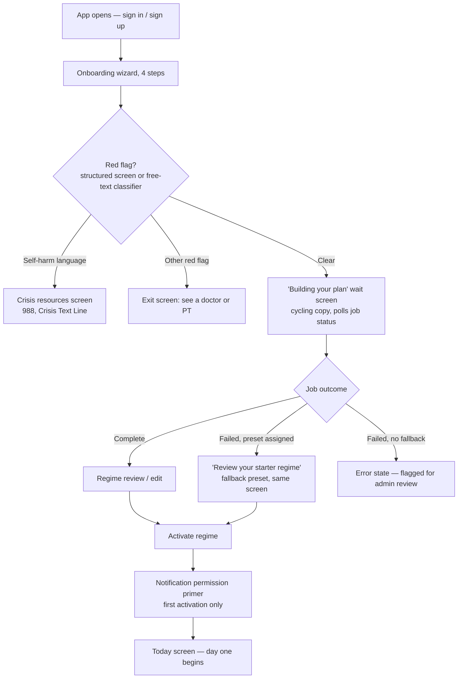
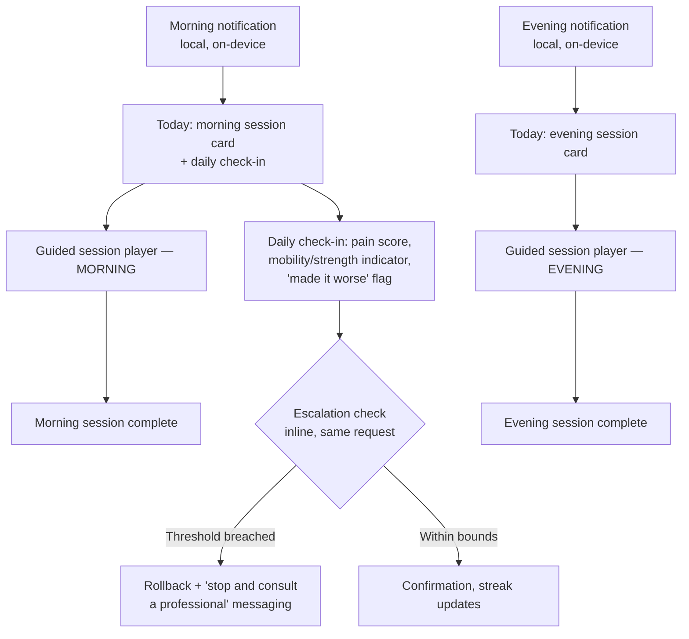
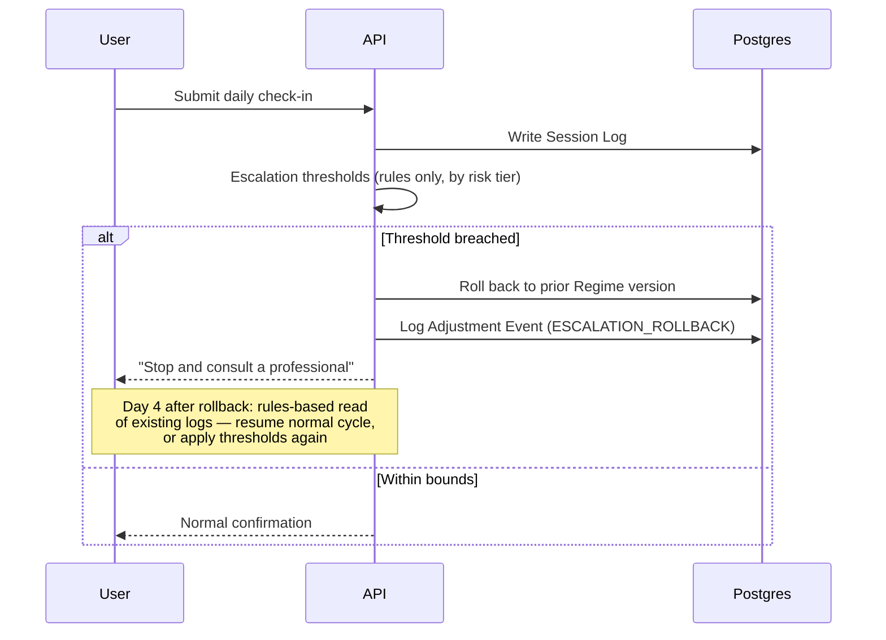
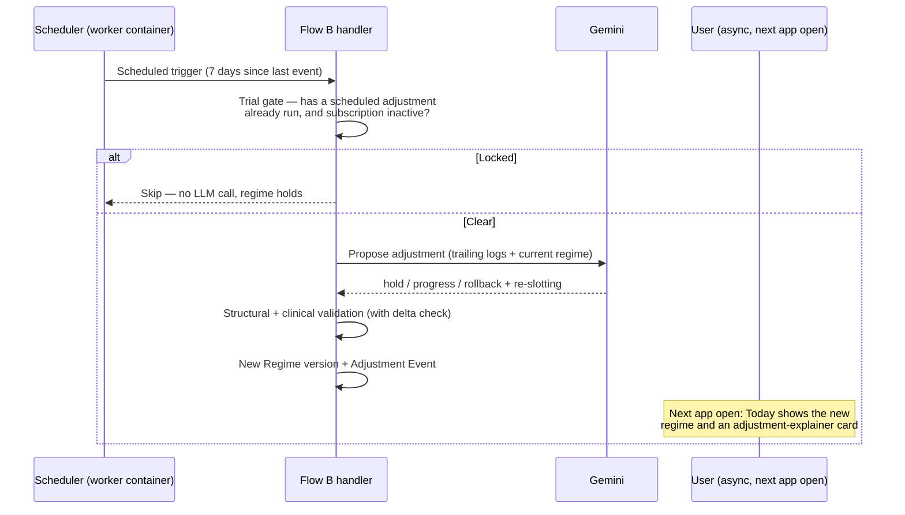
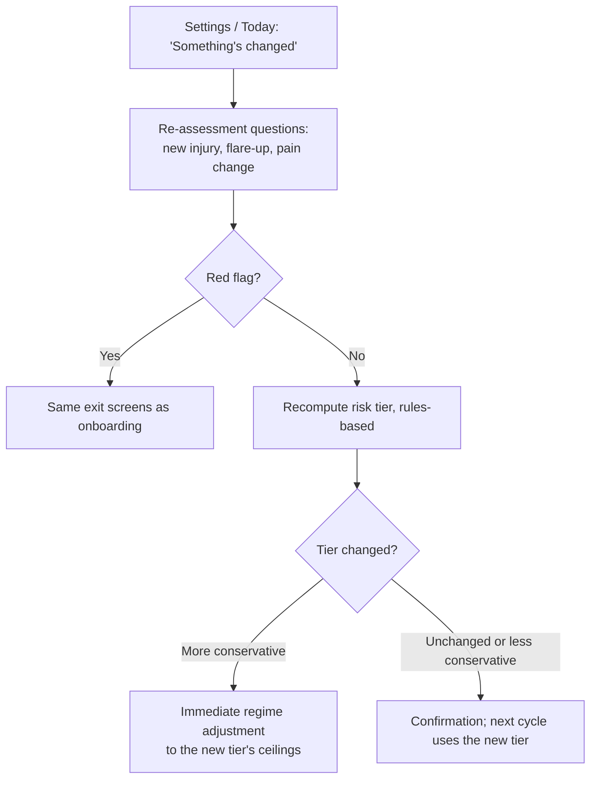
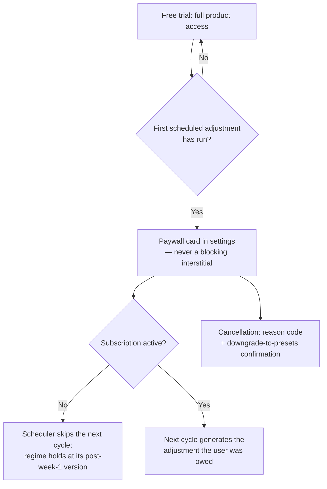

# Rebound.ai — User Flows

*The paths a user takes through the product. For the screens themselves and design tone, see [`DESIGN_BRIEF.md`](./DESIGN_BRIEF.md). For the safety logic gating these flows, see [`PRD.md`](./PRD.md)'s Clinical Risk Framing. For the technical sequence behind each step, see [`TDD.md`](./TDD.md).*

> **⚠️ Current state, 2026-09-01.** None of these flows are implemented, and the platform assumption below has changed: there is **no mobile app**, and Next.js web is currently the only surface. The one interaction that exists is *type a body part → see three exercises*, which corresponds to no flow in this document. See [`ENG_PLAN.md`](./ENG_PLAN.md).

> **[v2] These are mobile flows.** The product is the Expo app. Web carries marketing, pricing, and legal only — it has no onboarding, no session player, no account loop. v1 implemented every one of these flows twice, on web and mobile in parallel, over the same API. That duplication is where most of its real bugs came from.

---

## 1. Sign-up & Onboarding



**Step detail**

1. **Sign in / sign up** — self-hosted auth, email and password with verification. The app opens straight here; there is no in-app marketing page, because an app isn't publicly browsable by URL the way a website is. The marketing job happens *before* install, on the App Store listing and the website.
2. **Onboarding wizard** — sequenced steps, not one long form: reason for using the app → goal and target movement → risk and symptom questions → free-text context. Captures goal type, target movement, condition flags, structured red-flag answers, free-text symptoms and lifestyle context, wake time, evening time, and available equipment.
3. **Red-flag gate** — runs *both* the structured screen and the free-text classifier before any regime is drafted. A hit on either routes to an exit and never generates a regime. **Self-harm language routes to a dedicated crisis-resources screen**, separate from the generic "see a doctor" exit. These are two different screens serving two very different situations and they must not be merged.
4. **Wait screen** — cycling status copy ("Reviewing your goals… / Screening for safety… / Drafting your first regime…") rather than a bare spinner, while the async job runs: skeleton retrieval → LLM slot fill → structural validation → clinical validation.
5. **Regime review and edit** — exercises grouped by Morning and Evening, with sets, reps, duration, frequency, and slot editable per exercise, before the user commits.
6. **Activate** — re-validates server-side, supersedes any prior active regime, creates the day's workout-session rows, and starts tracking. First activation is what gates the one-time notification-permission primer.

> **Navigation invariants for this flow.** v1's real-device testing found users **physically stuck twice inside onboarding** — once with no way out but force-quitting, once on the regime review form with no back button — plus a post-activation screen that was a hard dead end with no link or button at all. Every screen in this wizard has a way back. Every terminal screen has a forward action. This is not a polish item.

---

## 1a. Flow A — the generation pipeline **[target design, 2026-09-01]**

*The server-side pipeline behind section 1. **Not built.** Nothing in this section exists in the code as of 2026-09-01 — the current system is one unauthenticated endpoint that queries a mock table and calls Gemini once, with no gates, no tiering, no retrieval, and no validation.*

> **Three parts of this design reverse decisions already recorded in `TDD.md`, and need ADRs before implementation rather than after.** They are marked **⚠ REVERSAL** below. v1's most expensive mistake was a decision re-litigated with no record of the original reasoning; the point of writing these down is that the reversal is deliberate and argued, not accidental.

### Phase 0 — Capture (client)

- On first app open, mint a `localSessionId` (uuid), persist client-side, and send it on every request as `X-Session-Id`.
- Sequenced onboarding wizard: reason → goal / target movement → risk & symptom questions → free-text context.
- Client-side validation: free text capped at 500–750 chars per field, a single primary `targetMovement`, equipment multi-select, wake and evening times.
- `POST /onboarding` with the session header. **Rate limit 5/hr keyed on both `localSessionId` and IP** — session alone is trivially rotated by clearing storage.

### Phase 1 — Resolve subject, persist, background

- **`withSession` replaces `withAuth`.** Reads the header, rejects a missing or malformed id with 400, opens the `prismaRls` transaction and sets `app.user_id` to that value. Same shape as `withAuth`, different source.
- `withAdminAuth` / `withAdminOnlyAuth` are unchanged — admin routes keep whatever gate is available, even if that is an env-var secret for now.
- `upsertUserForOnboarding` runs synchronously against `id = localSessionId`: writes `goalType`, `targetMovements`, `conditionFlags`, `wakeTimeMinutes`, `eveningTimeMinutes`, `availableEquipment`. **Omitted fields stay `undefined`** so re-submission never wipes a saved value.
- Check `User.manualHold` — unchanged; it is how a bad loop gets stopped mid-testing.
- Create `RegimeGenerationJob` (`PENDING`, `retryCount: 0`). The user row must exist first; the FK is required.
- Return the job id. Client polls `GET /onboarding/jobs/:jobId` every ~2s behind the cycling wait-screen copy. Job ownership is checked against `localSessionId`.

> **⚠ REVERSAL — the security model.** `TDD.md` specifies Better Auth with a two-tier RLS trust model, where `app.user_id` comes from a verified session. Here it comes from a **client-supplied header the client itself generates**. Anyone can set `X-Session-Id` to any value and read or write that subject's rows: RLS still executes, but it is enforcing an identity the caller chose. Acceptable for a dev build with no real users; **must not survive contact with real user data**. Its removal trigger is the first real user, not "when we get around to auth."

### Phase 2 — Safety gates (rules first, then classifier — both before any retrieval)

1. **Structured red-flag screen** — `checkRedFlags`, pure rules, zero I/O. Severe or sudden pain, numbness or tingling, trauma, post-surgical, pregnancy-related, cardiac exertion symptoms.
2. **Free-text classifier pass** — cheap model, classification only, over the symptom and lifestyle fields. Catches red flags disclosed in prose after being answered "no" in the structured screen. Logged to `LlmCall` as `FREE_TEXT_CLASSIFIER`.
3. **Crisis sub-check** — self-harm language routes to the dedicated crisis-resources screen (988, Crisis Text Line), **not** the generic exit.
4. **Gate decision.** A hit on either path terminates the pipeline here: the job resolves to a terminal red-flag outcome, the user sees the "see a doctor / PT" exit screen, no regime is generated and **no retrieval runs**. This ordering is deliberate — the pipeline should never begin assembling clinical literature on behalf of someone it is about to turn away.
5. **Classifier unavailable or erroring → fail closed on the classifier only.** Treat as inconclusive and route to human review rather than proceeding ungated.

> **Open question, flagged by the author and worth resolving before build.** Failing closed is the right instinct for a health product, but it carries an operational dependency: *"route to human review"* requires a review queue, an SLA, and a person watching it. Without those, fail-closed is a dead end that strands the user with no path forward — worse for them, if not for us. **Either build the queue in the same milestone or specify the user-visible fallback.** The alternative — proceeding on the structured screen alone — is what `PRD.md` currently implies.

### Phase 3 — Risk tiering and the constraint envelope

- `determineRiskTier` — rules-based, from age, condition type, pain severity, autoimmune/chronic flags. Writes `User.riskTier`.
- Build the **constraint envelope**: tier ceiling, `ABSOLUTE_BOUNDS`, equipment set, difficulty cap.
- **Invariant: the envelope is immutable from here.** Nothing downstream — not retrieval, not the model — can widen it. Computed once, passed down the whole pipeline, and the object the validator checks against later.

### Phase 4 — Skeleton selection (ahead of retrieval)

- `skeleton-retrieval.ts` runs its structured filter: `Preset` rows of `kind: SKELETON` narrowed by `goalType × riskTier`, then keyword-matched on `bodyRegionTags` against free-text target movement and symptoms. Deterministic, no embeddings.
- Fall back to a general-tagged skeleton if no region match.
- If no skeleton exists for that goal/tier combination: `skeleton = null`, mark the run **freeform**. Freeform runs skip Phases 5–6 and go to the legacy tool-use path.
- Load the skeleton's `PresetSlot` rows: `label`, `sessionSlot`, `orderIndex`, `exerciseCategory`, `muscleGroupTags`, `maxDifficulty`, `suggested*`, `rationale`.
- Record the chosen skeleton id and the match reason (goal/tier/region-tag vs. general fallback) for provenance.

> **Gap:** "the legacy tool-use path" refers to v1 code. **No such path exists in the v2 repo.** Freeform runs need a defined behaviour here, or this branch is a null pointer written in prose.

### Phase 5 — Retrieval, one query per slot

> **⚠ REVERSAL — RAG.** `TDD.md` currently states: *"Skeleton retrieval is a structured filter, not RAG… There is no vector database and no embedding index… **No vector database is warranted at any point on the current roadmap.**"* This phase introduces hybrid BM25 + dense retrieval with reciprocal rank fusion, a vector store, and a `RetrievalEvent` table. Note the two are **not** in conflict about *skeleton* selection — Phase 4 keeps the structured filter. The reversal is the introduction of a **retrieval corpus of clinical literature**, which the original decision did not contemplate at all. That distinction is the substance of the ADR.

- Build a **structured query object per slot** from slot constraints + user context (goal, tier, condition flags, target movement) — not one blended vector of the whole onboarding payload.
- **Hybrid query per slot:** BM25 + dense, reciprocal rank fusion. Clinical text carries high-value exact tokens that dense embeddings smear.
- **Metadata filters hard-exclude before ranking:** body region, population/tier applicability, evidence-grade floor, and a post-surgical / acute-pathology exclusion for non-injury goals.
- **Apply a relevance floor.** Below it, return zero chunks for that slot rather than the best of a bad set.
- **Retrieval is additive-only and never blocking.** Zero chunks, a timeout, or a vector-store error all degrade to the slot's authored rationale and the pipeline continues. **Retrieval failure is not a job failure.**
- **Skip Phase 5 entirely for `GENERAL_FITNESS` and `STRENGTH`**, or route them to a general dosage index rather than the condition-specific one. Condition-specific literature has little to say about a healthy athlete wanting more overhead range.
- Write a `RetrievalEvent` row per slot: query text, filters applied, chunk ids returned, scores, whether the floor was met. **New model — needs an explicit RLS decision.**

### Phase 6 — Candidate narrowing

- Per slot, query `Exercise` scoped to the slot's `exerciseCategory`, `muscleGroupTags`, `maxDifficulty`, and the user's equipment set — with `BODY_ONLY` and null-equipment rows always eligible.
- Return **top-k candidates per slot (start k ≈ 8)**. This replaces the `search_exercises` tool loop: the model picks from a menu instead of querying for one.
- If a slot has zero eligible candidates, relax **difficulty first, then equipment, then muscle tags**, in that order, logged. If still zero, drop the slot and note it.

### Phase 7 — Generation

- Assemble one prompt: constraint envelope, skeleton slots with labels and suggested dosage, per-slot candidate menus, per-slot retrieved chunks as clearly delimited reference material, and **user free text delimited as user-content and never as instruction**.
- **One LLM call**, `submit-skeleton-regime` tool, `max_tokens: 4096`. The model selects an exercise id per slot, personalizes dosage within the suggested ranges, confirms or adjusts morning/evening placement, and emits a short per-slot selection note.
- Wrapped by `loggedMessagesCreate()` → `LlmCall` with `groupId` / `sequenceIndex`, `source: PRODUCTION`.
- Self-correction budget retained for malformed tool shape, though invalid exercise ids should now be near-impossible given the menu.

### Phase 8 — Validation

- **Structural validation** — required fields, non-empty `exercise_list`, no duplicate exercises, sane numeric ranges, valid `SessionSlot` enums.
- **Clinical validation** — `validateRegime(draft, riskTier)`. Flow A supplies no `previousRegime`, so absolute bounds only; no delta check.
- **The invariant, stated explicitly: the validator receives the draft, the tier, and nothing else. It never sees retrieved context.** Retrieved text may inform selection and wording; it may never loosen a bound. This is exactly what a future contributor breaks while trying to improve error messages — so it belongs in a **test**, not only in prose.
- Failure → one retry with the specific rejection reason fed back as context. Second failure → `assignFallbackPreset` (`kind: FALLBACK`, matched by risk tier, **re-validated before persist**), job flagged for admin review. Model/API outage → exponential backoff, then the same fallback.

### Phase 9 — Persist with provenance

- Write `Regime` v1 as `DRAFT`, `createdBy: AGENT`, `sourcePresetId` set to the skeleton, `versionNumber: 1`.
- Write `RegimeExercise` rows carrying `sessionSlot`, `orderIndex`, dosage.
- **Write the provenance join:** for each `RegimeExercise`, the originating `PresetSlot` id, the retrieved chunk ids that informed it, and the model's selection note. **This is what makes Phase 10 possible at all.**
- Job → `COMPLETE`, `resultRegimeId` set. Polling client advances.

### Phase 10 — The preview page, with justification

**The moment the screen shows a citation it stops being a suggestion and starts being a clinical claim.** Four layers, in decreasing order of how much they can be trusted:

1. **Regime-level — "Why this plan looks like this."** One short block at the top, sourced from the skeleton: human-authored, PT-reviewable, identical for every user who gets that skeleton. Names the protocol shape and its source. **The safest text on the page, because no model wrote it.**
2. **Slot-level — "Why this block exists."** Per morning/evening group, or per slot if the UI can carry it. Sourced from `PresetSlot.rationale` plus its citation. Authored, not generated.
3. **Exercise-level — "Why this exercise."** The one that can hurt you, so constrain it hard. Render **template-filled from structured fields, not as free model prose**:

   ```
   Chosen for: scapular stabilizers · mobility · difficulty 2 · no equipment needed
   Fills: "Primary shoulder mobility drill"
   ```

   If the model's selection note is shown at all, label it unambiguously as an AI selection among eligible options, visually distinct from the cited protocol text above it. **The claim that can be defended is "this exercise satisfies a slot that a cited protocol calls for." The claim that cannot is "this exercise treats your shoulder."** Keep the copy on the first side of that line.
4. **Dosage-level — "Why these numbers."** Show the tier ceiling as a visible constraint rather than hidden logic — e.g. *conservative progression applied (light-injury tier)*. This makes the safety system legible instead of invisible, which is what a cautious user and a reviewing PT both want to see.

- **Citation rendering.** Each cited block gets source, year, and evidence grade. **Grade F is expert opinion and must look different from grade A on screen.** A tap opens the full recommendation text and a link out.
- **Graceful degradation, and no fabrication.** When retrieval returned nothing for a slot, the page falls back to the authored rationale alone, or to the structured template with no citation. It must **never** generate a citation-shaped sentence without a real chunk behind it. The "why" component should take provenance as a **required prop** and render the un-cited variant when it is absent — so the fabricating path does not exist in code.
- **Standing disclaimer**, in the safety-serious tone from `DESIGN_BRIEF.md`, not the athletic one: generated from published guidance, not a clinical prescription, not reviewed by a clinician for your specific case.

> **⚠ REVERSAL — the product's claim surface.** Showing sourced clinical justification moves the product materially closer to the SaMD line that Track 0's digital-health counsel is already reviewing. This is a **legal question before it is a design question.** Do not ship Phase 10 copy before that review lands.

### Phase 11 — Edit, activate

- User edits sets / reps / duration / frequency / slot per exercise.
- **Provenance must survive the edit.** Today an edit flips `createdBy` to `USER_EDITED` and nulls `sourcePresetId` — which **silently deletes every citation on the page**. Decouple these: keep `sourcePresetId` and the per-exercise provenance, and track user modification as a separate per-row `userModified` boolean. Mark edited rows as user-adjusted in the UI and drop the **dosage** justification for those specific rows, since the numbers are no longer the ones the protocol suggested.
- Activate → **server-side re-validation against the same envelope**, `status: ACTIVE`, today's `WorkoutSession` rows created for both slots.
- `versionNumber === 1` gates the one-time mobile notification-permission primer.
- Today screen. Session Log and Workout Session tracking begin from this point.

### The two dependencies most likely to be deferred and most expensive to retrofit

1. **The provenance chain** (Phases 4, 9, 10, 11) determines whether the "why" feature is possible at all, and it is the piece most likely to be deferred as *"we'll add it when we build the UI."* **Add the columns in the same migration as the retrieval work.**
2. **Phase 10 is worth prototyping against a hand-written provenance record before any vector database exists.** If the page does not read as trustworthy with perfect made-up citations, RAG will not save it — and that is an afternoon's finding instead of a month's.

---

## 2. Daily core loop



**Step detail**

- **Today screen** — both session cards, the streak line, the daily check-in, and an adjustment-explainer card once the regime has been adjusted at least once. **Session cards and the pain score lead. Not a progress ring.**
- **Guided session player** — steps through the slot's exercises one at a time with client-side timing, writing the session duration on completion. A quick "mark complete" path exists too, without the player. **The tab bar is hidden during a session.**
- **Daily check-in** is bundled with the morning session — one log per day, enforced by a date-keyed constraint.
- **Streak** — maintained by completing **at least one** of the day's two sessions. Computed by walking backward from today (or yesterday, if today hasn't happened yet) counting consecutive days with at least one completed session.
- **Escalation check** runs inline inside the check-in write, before the response returns. No separate step, no delay, and no LLM call.

> **Two v1 bugs that lived in this loop.** Workout-session rows were created only for the current day, once, at activation — so **crossing midnight silently disabled "mark session complete" with no feedback at all.** And a same-day regime change left the new regime's exercises paired with the old regime's completion timestamps. Both are schema-level fixes; see `DATA_MODEL.md`.

---

## 3. Escalation / safety rollback



The user experiences this as messaging on the Today screen after submitting a check-in — not a separate screen. Thresholds are risk-tier-dependent and documented in `PRD.md`.

**This path never calls an LLM.** That is deliberate: it makes the real-time safety backstop structurally immune to model-provider outages, unlike the weekly cycle. It is also, per the literature finding in `PRD.md`, plausibly the *clinically load-bearing* component of the whole system — the research identifies large single-session spikes, not weekly percentages, as the real injury-risk signal.

The rollback messaging is one of three screens that stay clinical and serious regardless of brand tone. See `DESIGN_BRIEF.md`.

---

## 4. Weekly adjustment (Flow B)



This runs entirely outside a live user session — there is no in-the-moment screen for it. **The trial gate runs before any LLM call**, so a locked-out user costs nothing to evaluate. The user's next interaction with Today surfaces the result: the updated regime, the explainer card, and a new entry in adjustment history. Or, if locked, the paywall card from Flow 6.

**[v2]** The scheduler runs in a worker container rather than as a hosting provider's cron, so this flow is reproducible locally.

---

## 5. Regime restart

Reachable from settings. The user picks a reason code (goals changed / starting over / other) plus an optional comment, then re-runs onboarding-style generation from scratch rather than adjusting incrementally.

Distinct from Flow B: **user-initiated and immediate**, not agent-proposed and scheduled.

---

## 6. Risk-tier re-assessment **[v2 — new]**



**v1 never built this**, despite the risk tier being *the only lever controlling how aggressively a regime can progress.* It appeared as an open item in four separate documents and was never closed. A user who develops a new injury mid-program has no way to tell the system, and the system keeps progressing them under the old assumptions.

Two design constraints:

- The re-assessment reuses the same red-flag screen as onboarding, so a newly-disclosed red flag exits the same way.
- **A tier moving in the conservative direction takes effect immediately, not at the next weekly cycle.** Waiting a week to reduce a ceiling defeats the purpose.

---

## 7. Subscription & billing



Trial-status computation checks for a *scheduled* adjustment event, **deliberately excluding escalation rollbacks** — a safety rollback is not the product completing a normal cycle, and counting it as trial usage would penalize the users having the worst time.

**Never an upfront gate.** There is an engineered small win before any monetization ask — regime generation plus a first completed session — and that moment is deliberately not interrupted with settings or paywall noise.

> **[v2]** Cancellation reason codes must **persist to the database**. v1 validated and logged them without storing them, so the churn guardrail metric had nothing behind it.

---

## 8. Admin flows

Admin surfaces stay on **web**, not mobile — they're operational tools, not product.

- **Flagged users** — review users with an escalation rollback, a "made it worse" flag, or a failed generation job. Toggle a manual hold with a required reason. That hold is checked by **both** the escalation monitor and the scheduler.
- **Flow experimentation** — pick a fixture and a model, trigger a Flow A or Flow B dry run, inspect the full call trace. Never touches real user data.
- **Scenario simulator** — chain a Flow A draft into multiple synthetic Flow B cycles against a chosen pain pattern (improving, plateauing, worsening, contradictory), then view the pain-trend chart and per-cycle regime diff.

> The scenario simulator is **the mechanism that produces the held-out test set a clinical advisor reviews.** That makes it a launch-gate dependency, not just a developer convenience. Build it accordingly.

> **v1 gotcha:** the admin dashboard silently returned nothing in the browser for a while, because the only admin user was a test-script account and the queries had no error handling — so the permission error was invisible. Admin screens surface their errors.

---

## Notification touches

- **First touch** — a primer explaining the value *before* the OS permission prompt, shown once, right after first activation.
- **Second touch [v2 — new]** — a "protect your streak" re-ask, after a streak exists and the user has felt the value. Never built in v1.

Both notifications are **local and on-device**, recomputed on app open. Not server push — which is one reason the workout-session pre-creation gap in `DATA_MODEL.md` hasn't bitten yet, and would if that ever changed.
