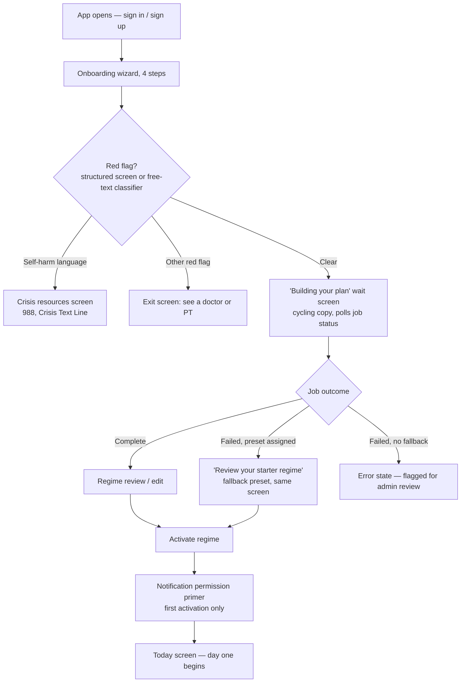
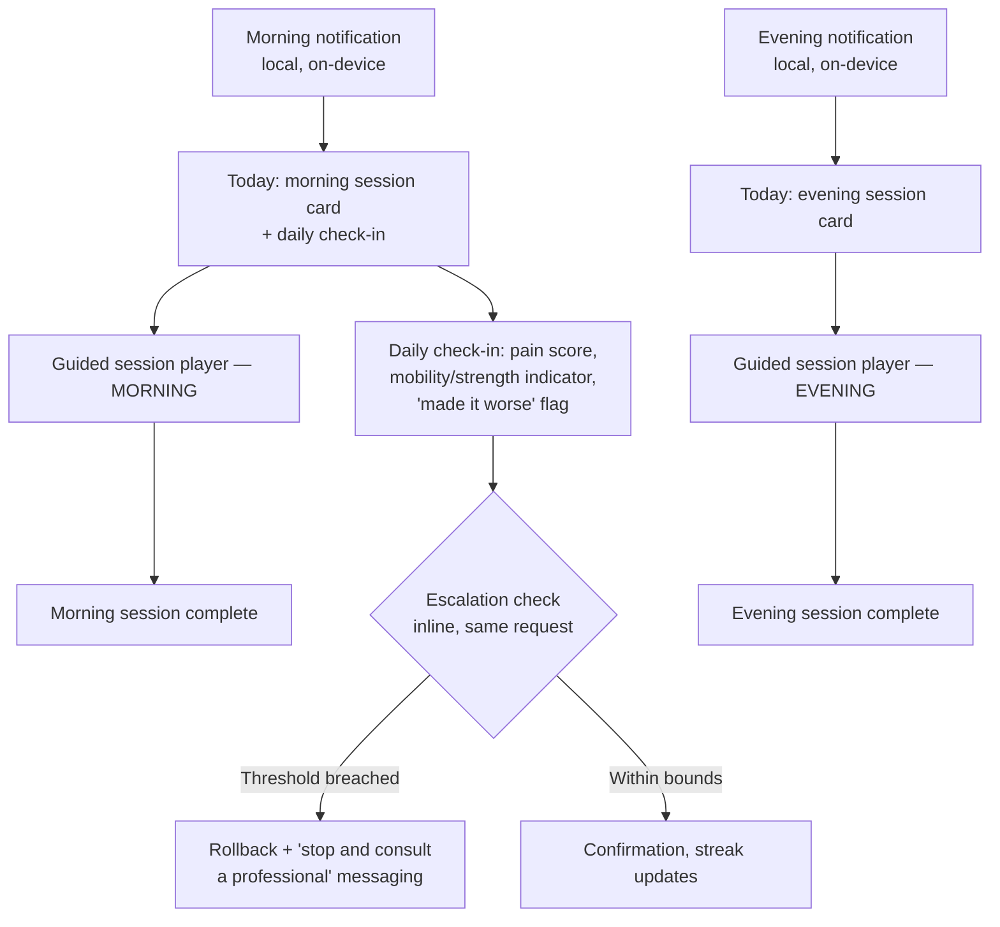
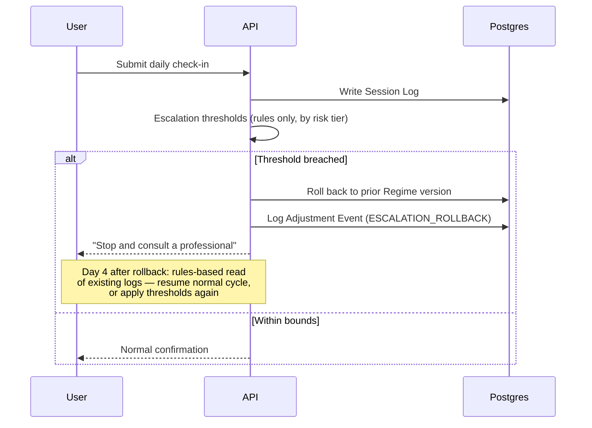
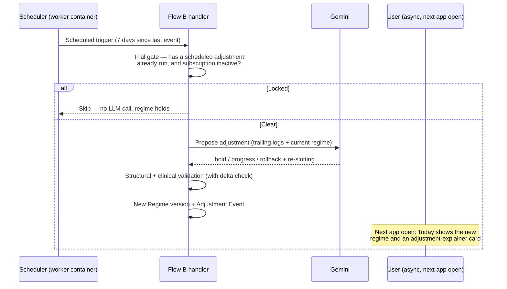
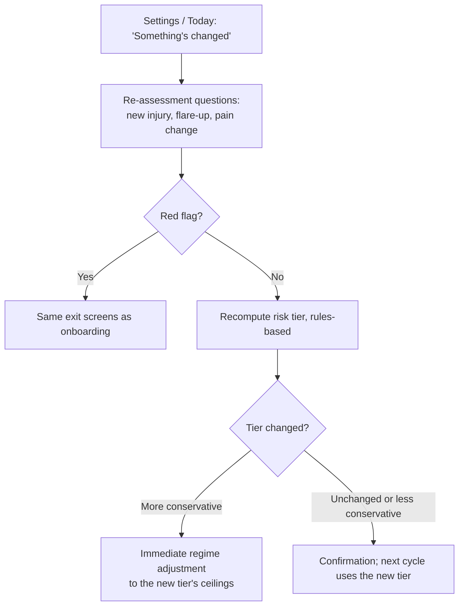
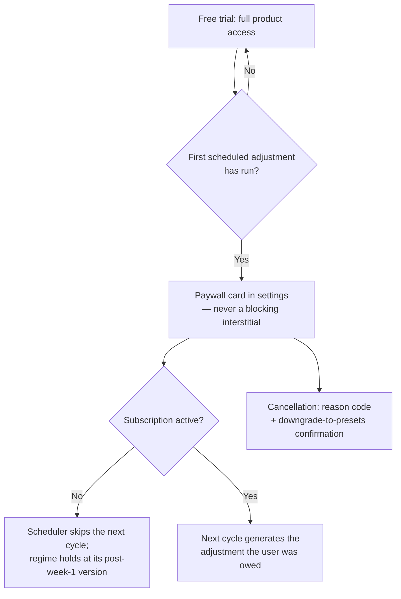

# Rebound.ai — User Flows

*The paths a user takes through the product. For the screens themselves and design tone, see [`DESIGN_BRIEF.md`](./DESIGN_BRIEF.md). For the safety logic gating these flows, see [`PRD.md`](./PRD.md)'s Clinical Risk Framing. For the technical sequence behind each step, see [`TDD.md`](./TDD.md).*

> **⚠️ Current state, 2026-09-01.** None of these flows are implemented, and the platform assumption below has changed: there is **no mobile app**, and Next.js web is currently the only surface. The one interaction that exists is *type a body part → see three exercises*, which corresponds to no flow in this document. See [`ENG_PLAN.md`](./ENG_PLAN.md).

> **[v2] These are mobile flows.** The product is the Expo app. Web carries marketing, pricing, and legal only — it has no onboarding, no session player, no account loop. v1 implemented every one of these flows twice, on web and mobile in parallel, over the same API. That duplication is where most of its real bugs came from.

---

## 1. Sign-up & Onboarding

**Step detail**

1. **Sign in / sign up** — self-hosted auth, email and password with verification. The app opens straight here; there is no in-app marketing page, because an app isn't publicly browsable by URL the way a website is. The marketing job happens *before* install, on the App Store listing and the website.
2. **Onboarding wizard** — sequenced steps, not one long form: reason for using the app → goal and target movement → risk and symptom questions → free-text context. Captures goal type, target movement, condition flags, structured red-flag answers, free-text symptoms and lifestyle context, wake time, evening time, and available equipment.
3. **Red-flag gate** — runs *both* the structured screen and the free-text classifier before any regime is drafted. A hit on either routes to an exit and never generates a regime. **Self-harm language routes to a dedicated crisis-resources screen**, separate from the generic "see a doctor" exit. These are two different screens serving two very different situations and they must not be merged.
4. **Wait screen** — cycling status copy ("Reviewing your goals… / Screening for safety… / Drafting your first regime…") rather than a bare spinner, while the async job runs: skeleton retrieval → LLM slot fill → structural validation → clinical validation.
5. **Regime review and edit** — exercises grouped by Morning and Evening, with sets, reps, duration, frequency, and slot editable per exercise, before the user commits.
6. **Activate** — re-validates server-side, supersedes any prior active regime, creates the day's workout-session rows, and starts tracking. First activation is what gates the one-time notification-permission primer.

> **Navigation invariants for this flow.** v1's real-device testing found users **physically stuck twice inside onboarding** — once with no way out but force-quitting, once on the regime review form with no back button — plus a post-activation screen that was a hard dead end with no link or button at all. Every screen in this wizard has a way back. Every terminal screen has a forward action. This is not a polish item.

---

## 2. Daily core loop

**Step detail**

- **Today screen** — both session cards, the streak line, the daily check-in, and an adjustment-explainer card once the regime has been adjusted at least once. **Session cards and the pain score lead. Not a progress ring.**
- **Guided session player** — steps through the slot's exercises one at a time with client-side timing, writing the session duration on completion. A quick "mark complete" path exists too, without the player. **The tab bar is hidden during a session.**
- **Daily check-in** is bundled with the morning session — one log per day, enforced by a date-keyed constraint.
- **Streak** — maintained by completing **at least one** of the day's two sessions. Computed by walking backward from today (or yesterday, if today hasn't happened yet) counting consecutive days with at least one completed session.
- **Escalation check** runs inline inside the check-in write, before the response returns. No separate step, no delay, and no LLM call.

> **Two v1 bugs that lived in this loop.** Workout-session rows were created only for the current day, once, at activation — so **crossing midnight silently disabled "mark session complete" with no feedback at all.** And a same-day regime change left the new regime's exercises paired with the old regime's completion timestamps. Both are schema-level fixes; see `DATA_MODEL.md`.

---

## 3. Escalation / safety rollback

The user experiences this as messaging on the Today screen after submitting a check-in — not a separate screen. Thresholds are risk-tier-dependent and documented in `PRD.md`.

**This path never calls an LLM.** That is deliberate: it makes the real-time safety backstop structurally immune to model-provider outages, unlike the weekly cycle. It is also, per the literature finding in `PRD.md`, plausibly the *clinically load-bearing* component of the whole system — the research identifies large single-session spikes, not weekly percentages, as the real injury-risk signal.

The rollback messaging is one of three screens that stay clinical and serious regardless of brand tone. See `DESIGN_BRIEF.md`.

---

## 4. Weekly adjustment (Flow B)

This runs entirely outside a live user session — there is no in-the-moment screen for it. **The trial gate runs before any LLM call**, so a locked-out user costs nothing to evaluate. The user's next interaction with Today surfaces the result: the updated regime, the explainer card, and a new entry in adjustment history. Or, if locked, the paywall card from Flow 6.

**[v2]** The scheduler runs in a worker container rather than as a hosting provider's cron, so this flow is reproducible locally.

---

## 5. Regime restart

Reachable from settings. The user picks a reason code (goals changed / starting over / other) plus an optional comment, then re-runs onboarding-style generation from scratch rather than adjusting incrementally.

Distinct from Flow B: **user-initiated and immediate**, not agent-proposed and scheduled.

---

## 6. Risk-tier re-assessment **[v2 — new]**

**v1 never built this**, despite the risk tier being *the only lever controlling how aggressively a regime can progress.* It appeared as an open item in four separate documents and was never closed. A user who develops a new injury mid-program has no way to tell the system, and the system keeps progressing them under the old assumptions.

Two design constraints:

- The re-assessment reuses the same red-flag screen as onboarding, so a newly-disclosed red flag exits the same way.
- **A tier moving in the conservative direction takes effect immediately, not at the next weekly cycle.** Waiting a week to reduce a ceiling defeats the purpose.

---

## 7. Subscription & billing

Trial-status computation checks for a *scheduled* adjustment event, **deliberately excluding escalation rollbacks** — a safety rollback is not the product completing a normal cycle, and counting it as trial usage would penalize the users having the worst time.

**Never an upfront gate.** There is an engineered small win before any monetization ask — regime generation plus a first completed session — and that moment is deliberately not interrupted with settings or paywall noise.

> **[v2]** Cancellation reason codes must **persist to the database**. v1 validated and logged them without storing them, so the churn guardrail metric had nothing behind it.

---

## 8. Admin flows

Admin surfaces stay on **web**, not mobile — they're operational tools, not product.

- **Flagged users** — review users with an escalation rollback, a "made it worse" flag, or a failed generation job. Toggle a manual hold with a required reason. That hold is checked by **both** the escalation monitor and the scheduler.
- **Flow experimentation** — pick a fixture and a model, trigger a Flow A or Flow B dry run, inspect the full call trace. Never touches real user data.
- **Scenario simulator** — chain a Flow A draft into multiple synthetic Flow B cycles against a chosen pain pattern (improving, plateauing, worsening, contradictory), then view the pain-trend chart and per-cycle regime diff.

> The scenario simulator is **the mechanism that produces the held-out test set a clinical advisor reviews.** That makes it a launch-gate dependency, not just a developer convenience. Build it accordingly.

> **v1 gotcha:** the admin dashboard silently returned nothing in the browser for a while, because the only admin user was a test-script account and the queries had no error handling — so the permission error was invisible. Admin screens surface their errors.

---

## Notification touches

- **First touch** — a primer explaining the value *before* the OS permission prompt, shown once, right after first activation.
- **Second touch [v2 — new]** — a "protect your streak" re-ask, after a streak exists and the user has felt the value. Never built in v1.

Both notifications are **local and on-device**, recomputed on app open. Not server push — which is one reason the workout-session pre-creation gap in `DATA_MODEL.md` hasn't bitten yet, and would if that ever changed.
